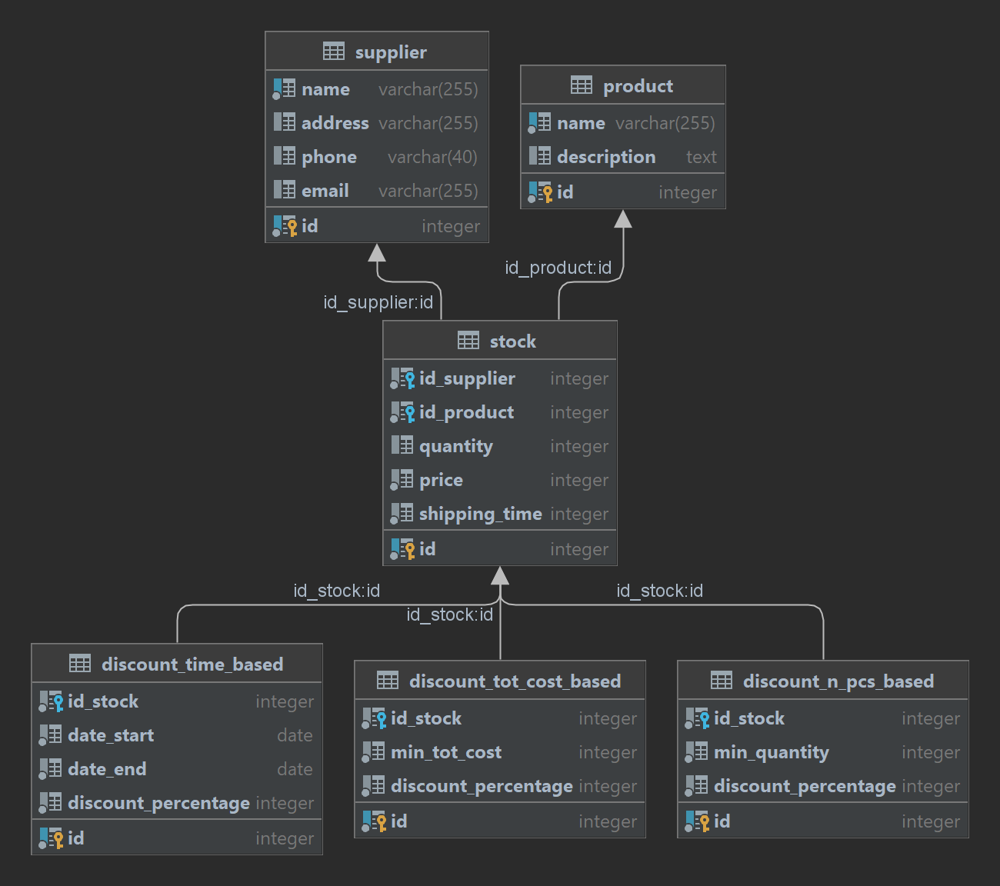

# Purchase orders for stock replenishment

## How to run the project

### Requirements

- [docker](https://docs.docker.com/get-docker/)
- docker-compose
- Python

### Run the project

- Clone the repository
- run `pip install psycopg2-binary`
- run `docker-compose up --build`
- run `python init_db.py`
- open the browser and go to `http://localhost:3000/`

## Functional analysis

### Narrative

- As a shop seller
  I want to see the list of suppliers of a certain quantity of a product
  so that I can see for each supplier the total cost and shipping days
- As a shop seller
  I want the cheapest is highlighted
  so that I can see the min of all the costs
- As a shop seller
  I want the see all the actual and future offers for each article of the suppliers
  so that I can wait the period in witch the cost is lower
- As a shop seller
  I want update the data of a product in case of changes
  so that I can see always the actual data

### Acceptance criteria

- Given the main page
  When the shop seller fill the form with the product name and the quantity and click on the button "Search"
  Then the page show the list of suppliers with the total cost, shipping days, the list of offers and highlight the cheapest
- Given the page in which update the data of the products
  When the shop seller enter on this page
  Then the page show the list of all the products
- Given the page in which update the data of the products
  When the shop seller click on the button "Add supplier"
  Then the page show the form to add a new supplier
- Given the page in which update the data of the products
  When the shop seller click on the button "Add product"
  Then the page show the form to add a new product
- Given the page in which update the data of the products
  When the shop seller click on the button "Add offer"
  Then the page show the form to add a new offer

## Architecture

### Database

I choose postgresql to make a relational.
The database is composed by 6 tables:

- supplier: it contains the info of the suppliers
- product: it contains the info of the products
- stock: it represents the relation between the suppliers and the products, the quantity left in the stock, the retail price and the shipping time
- discount_n_pcs_based: it contains the percentage discount if the quantity of the product is greater than min_quantity
- discount_tot_cost_based: it contains the percentage discount if the total cost of the order is greater than min_tot_cost
- discount_time_based: it contains the percentage discount if the date is between date_start and date_end

This is the ER diagram of the database:

Here there are the detailed columns and the referential integrity constraints of the tables:

      CREATE TABLE supplier (
          id SERIAL PRIMARY KEY NOT NULL,
          name VARCHAR(255) NOT NULL UNIQUE,
          address VARCHAR(255),
          phone VARCHAR(40),
          email VARCHAR(255)
      );
      CREATE TABLE product (
          id SERIAL PRIMARY KEY NOT NULL,
          name VARCHAR(255) NOT NULL UNIQUE,
          description text
      );
      CREATE TABLE stock (
          id SERIAL PRIMARY KEY NOT NULL,
          id_supplier INTEGER NOT NULL,
          id_product INTEGER NOT NULL,
          quantity INTEGER DEFAULT 0,
          price INTEGER NOT NULL,
          shipping_time INTEGER NOT NULL,
          
          CONSTRAINT fk_supplier
              FOREIGN KEY (id_supplier)
              REFERENCES supplier (id)
              ON DELETE CASCADE,
          CONSTRAINT fk_product
              FOREIGN KEY (id_product)
              REFERENCES product (id)
              ON DELETE CASCADE
      );
      CREATE TABLE discount_n_pcs_based (
          id SERIAL PRIMARY KEY NOT NULL,
          id_stock INTEGER NOT NULL,
          min_quantity INTEGER NOT NULL,
          discount_percentage INTEGER NOT NULL,
          
          CONSTRAINT fk_stock
              FOREIGN KEY (id_stock)
              REFERENCES stock (id)
              ON DELETE CASCADE
      );
      CREATE TABLE discount_tot_cost_based (
          id SERIAL PRIMARY KEY NOT NULL,
          id_stock INTEGER NOT NULL,
          min_tot_cost INTEGER NOT NULL,
          discount_percentage INTEGER NOT NULL,
          
          CONSTRAINT fk_stock
              FOREIGN KEY (id_stock)
              REFERENCES stock (id)
              ON DELETE CASCADE
      );
      CREATE TABLE discount_time_based (
          id SERIAL PRIMARY KEY NOT NULL,
          id_stock INTEGER NOT NULL,
          date_start DATE NOT NULL,
          date_end DATE NOT NULL,
          discount_percentage INTEGER NOT NULL,
          
          CONSTRAINT fk_stock
              FOREIGN KEY (id_stock)
              REFERENCES stock (id)
              ON DELETE CASCADE
      );
